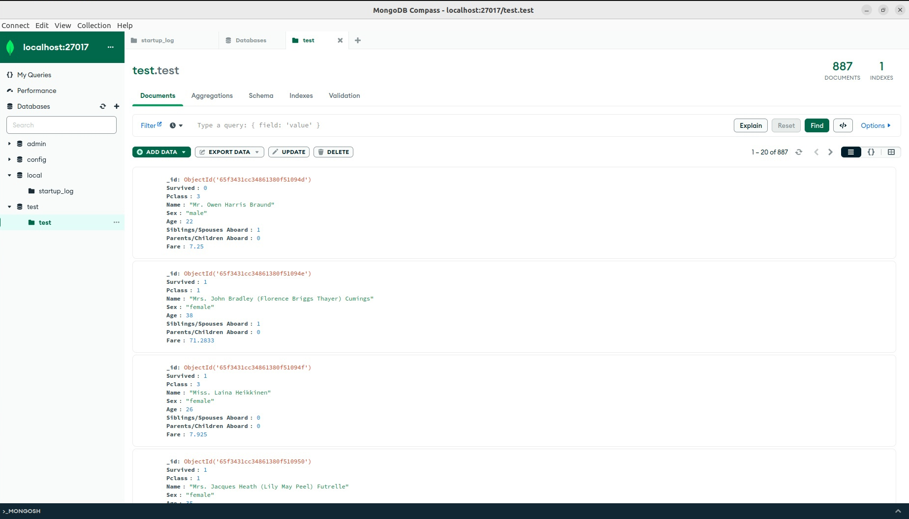
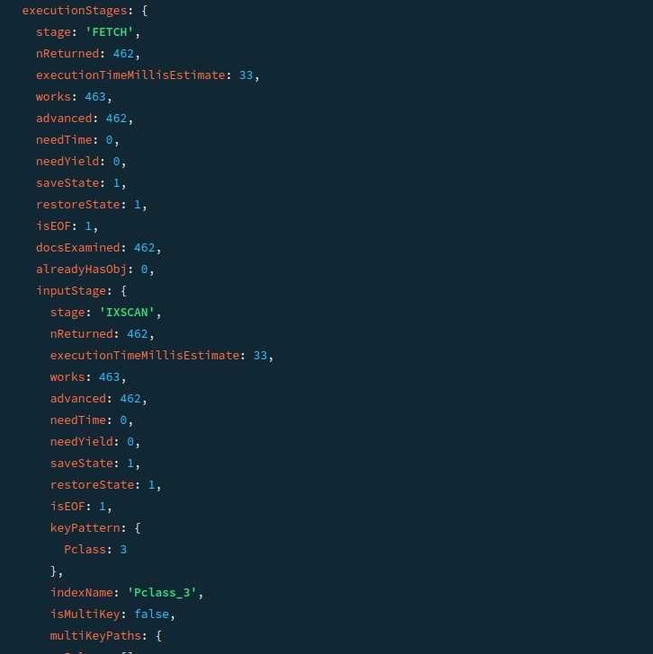

# MongoDB
## Установка
Прежде всего нужно установить MongoDB,  используем для этого docker:
(**[https://phoenixnap.com/kb/docker-mongodb](https://phoenixnap.com/kb/docker-mongodb)**).
Так же установим   UI :
(**[https://www.mongodb.com/try/download/compass](https://www.mongodb.com/try/download/compass)**)
После необходимых установок получаем такой результат:

## Данные
Заполним БД данными (я выбрал https://web.stanford.edu/class/archive/cs/cs109/cs109.1166/problem12.html - датасет с пассажирами Титаника).

## CRUD

Сперва выполним несколько запросов поиска:
- Найдем все имена начинающиеся с "Mr.", выберем только колонки имени и возраста,  отсортируем по возрасту и вернем первые 4: (прим. сортировка сработает если не указывать возраст в возвращаемых значениях)      
  
- Посчитаем количество людей, возраста от 20 до 22: 
  

Далее попробуем сделать insert и delete:
- 

Так же сделаем операцию update:
- сперва посмотрим на количество выживших в возрасте от 30 до 40, затем обновим поле "Survived" с 0 на 1: 

Как видно из скриншота выше, обновились только те документы, у которых поле "Survived" было 0.

В конце удалим несколько записей по условию:

## Индекс
Посмотрим на индексы в MongoDB. 
Сперва выполним запрос "db.test.find({"Pclass":3}).explain("executionStats")", который предоставит нам статистику по запросу:

После создадим индекс: 

И снова посмотрим на статистику запроса:

Как видно из скриншотов, works уменьшился, так же как и needTime, что говорит о том, что с использованием индекса нагрузка на базу,
при выполнении запроса ниже, и время на запрос так же ниже.
