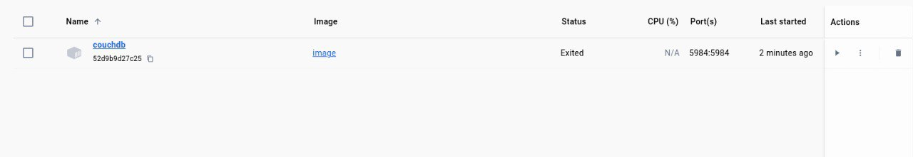
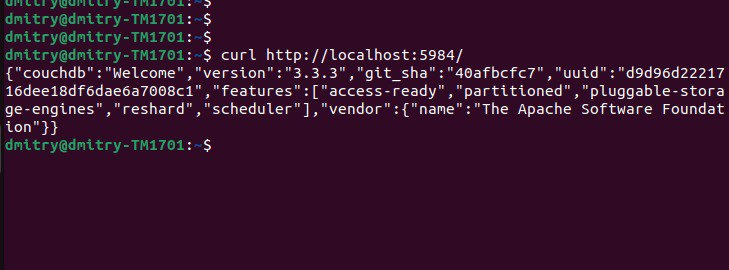
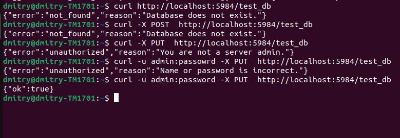
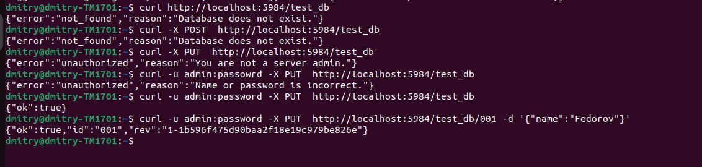

# REDIS
## Установка
Как говорится, давайте в последний раз,

    docker run -d --name my-couchdb -e COUCHDB_USER=admin -e COUCHDB_PASSWORD=password -p 5984:5984 couchdb:3.3.3
И в докер клиенте, ожидаемо получаем:

(В последствии, я перешел на couchdb:2.3, но об этом позже)

## Данные
Создаем БД и фаил со своей фамилией:

    curl -u admin:password -X PUT  http://localhost:5984/test_db
    curl -u admin:password -X PUT  http://localhost:5984/test_db/001 -d '{"name":"Fedorov"}'

(До версии 3, couch не требовал обязательной авторизации админа, поэтому в 2.3  -u ... можно опустить)

Проверка работоспособности:

Попытки угададать авторизацию и создать БД:

Создание документа

    
## Подключение
Так как у меня долго не получалось настроить подключение PouchDB к CouchDb, опишу свои попытки
- Сперва была проблема "Access to fetch at 'http://localhost:5984/test_db/' from origin 'null' has been blocked by CORS policy: Response to preflight request doesn't pass access control check". Я думал что проблема в авторизации, и пробовал использовать PouchDB Authentication (https://github.com/pouchdb-community/pouchdb-authentication), но проблема не ушла
- В итоге PouchDB Authentication не помог и я перешел на couchdb 2.3, где нет обязательного пользователя, но и это не помогло избавиться от ошибки
- И решением оказалось подправить Configuration БД (если читать задание внимательнее, то можно опустить шаги выше), что я благополучно стянул из https://github.com/timbophillips/couchdb-docker-cors , указав версию couch 2.3

Запустив Dockerfile и проделав те же операции по созданию БД и пользователя,
при запуске html файла (с указанием Remote: new PouchDB('http://localhost:5984/test_db')), видим, что pouch смог подключиться к couch:

Проверяя, что все работает, отключаем докер контейнер CouchDB, и видим что кеш не пропадает:

И, после остановки, картинка в браузере не меняется(ура, оно работает, см фаил PouchDB.html)
