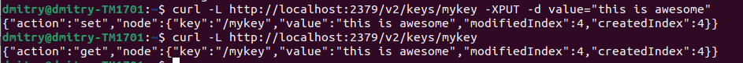
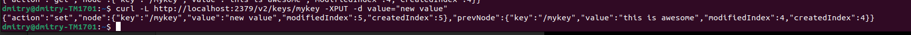
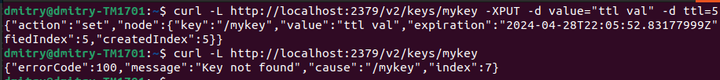
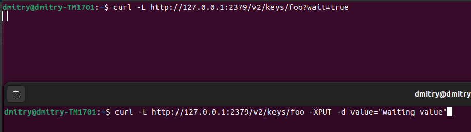
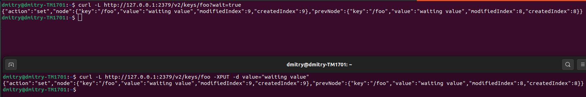

# ETCD
(https://etcd.io/)

Разработанный командой CoreOS и теперь являющийся проектом CNCF (Cloud Native Computing Foundation). Позиционируется как 
высоконадежное, высокопроизводительное и строго согласованное решение (отвечает ACID). В частнгости часто используется в 
связке с Kubernetes, для хранения информации о состоянии кластера.

- распределенная open-source key-value база данных 
- использует диск в качестве хранилища, данные хранятся в структуре, аналогичной файловой системе с поддерэкой наймспейсов 
- использует алгоритм консенсуса RAFT (как Kafka, Scylla), как следствие требует от 3х нод (n/2 +1) для работы
- https/console/gRPC взаимодействие
- поддержка транзакций и распределенных блокировок
- использует B-tree индексы для ключей
- предназначен для хранения объемов данных до нескольких гигабайт


## Key-Value DB operations
- put (etcdctl put foo bar)
- del single/range (etcdctl del foo)
- get single/range (etcdctl get key1 key2 --print-value-only)
- watch single/range - отслеживание изменений ключа (etcdctl watch foo)
- txn (etcdtcl txn ...)

Транзакции имеют следующий формат
```ebnf
<Txn> ::= <CMP>* "\n" <THEN> "\n" <ELSE> "\n"
<CMP> ::= (<CMPCREATE>|<CMPMOD>|<CMPVAL>|<CMPVER>|<CMPLEASE>) "\n"
<CMPOP> ::= "<" | "=" | ">"
<CMPCREATE> := ("c"|"create")"("<KEY>")" <CMPOP> <REVISION>
<CMPMOD> ::= ("m"|"mod")"("<KEY>")" <CMPOP> <REVISION>
<CMPVAL> ::= ("val"|"value")"("<KEY>")" <CMPOP> <VALUE>
<CMPVER> ::= ("ver"|"version")"("<KEY>")" <CMPOP> <VERSION>
<CMPLEASE> ::= "lease("<KEY>")" <CMPOP> <LEASE>
<THEN> ::= <OP>*
<ELSE> ::= <OP>*
<OP> ::= ((see put, get, del etcdctl command syntax)) "\n"
<KEY> ::= (%q formatted string)
<VALUE> ::= (%q formatted string)
<REVISION> ::= "\""[0-9]+"\""
<VERSION> ::= "\""[0-9]+"\""
<LEASE> ::= "\""[0-9]+\""
```

(https://github.com/etcd-io/etcd/blob/main/etcdctl/README.md)

## Практика
Из оффициальной документации (https://etcd.io/docs/v2.3/docker_guide/) возьмем команду на развертывание 3х нод etcd.

```ebnf
docker run -d -v /usr/share/ca-certificates/:/etc/ssl/certs -p 4001:4001 -p 2380:2380 -p 2379:2379 \
 --name etcd quay.io/coreos/etcd:v2.3.8 \
 -name etcd0 \
 -advertise-client-urls http://${HostIP}:2379,http://${HostIP}:4001 \
 -listen-client-urls http://0.0.0.0:2379,http://0.0.0.0:4001 \
 -initial-advertise-peer-urls http://${HostIP}:2380 \
 -listen-peer-urls http://0.0.0.0:2380 \
 -initial-cluster-token etcd-cluster-1 \
 -initial-cluster etcd0=http://${HostIP}:2380 \
 -initial-cluster-state new
```
Магия докера дает нам запущенный инстанс БД:


Проверим, что все работает:
(api:https://etcd.io/docs/v2.3/api/)
-  curl -L http://localhost:2379/v2/keys/mykey -XPUT -d value="this is awesome"
- curl -L http://localhost:2379/v2/keys/mykey



При обновлении ключа видим новое и старое значения:
-  curl -L http://localhost:2379/v2/keys/mykey -XPUT -d value="new value"


Так же можно указывать ttl в секундах для ключа 
-  curl -L http://localhost:2379/v2/keys/mykey -XPUT -d value="ttl val" -d ttl=5

Как видим ключ удалился.

## Watch
Посмотрим на фичу с watch-ингом изменения, для этого в одном окне сделаем запрос
- curl -L http://127.0.0.1:2379/v2/keys/foo?wait=true

А в другом сделаем update этой записи:
- curl -L http://127.0.0.1:2379/v2/keys/foo -XPUT -d value="waiting value"






На первой картинке отправляем запрос с ожиданием. После того, как отправили запрос на обновления, сразу видим результаты двух запросов.

