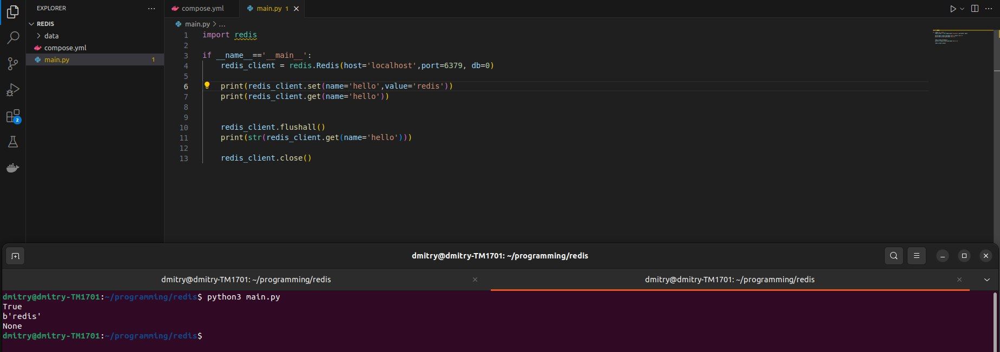

# REDIS
## Установка
Для установки воспользуемся докером. Подключимся к контейнеру с редисом через питон и удостоверимся, что все работает:

## Данные
Для тестов сгенерируем json на 20МБ (https://json-generator.com)

Формат данных - лист пользователей, у каждого уникальный _id.

## Tests
Протестируем, как редис справляется с вставкой/ удалением
### ZSet
Сперва попробуем отсортированное множество, в качестве ключа будем использовать возраст 
Фрагмент кода:

    times_insert = []
    times_select = []
    age_max = max([data[k]['age'] for k in data])
    age_min = min([data[k]['age'] for k in data])

    for k in tqdm(data):
        start = time.time_ns()
        redis_client.zadd('users',{json.dumps(data[k]): data[k]['age'] })
        delta = time.time_ns() - start
        times_insert.append(delta / 1000000)

    for k in tqdm(data):
        
        age_from = random.randint(age_min, age_max)
        age_to = random.randint(age_min, age_max)
        if age_from > age_to:
            age_from,age_to = age_to, age_from

        start = time.time_ns()
        data = redis_client.zrange('users',age_from, age_to)
        delta = time.time_ns() - start
        assert data is not None
        times_select.append(delta / 1000000)

В результате средне время вставки 0.53 миллисекунды, поиска (среза) 0.79мс

### HSet
Аналогичные измерения для hSet, ключ - _id
Фрагмент кода:

    times_insert = []
    times_select = []
    
    for k in tqdm(data):
        start = time.time_ns()
        redis_client.hset('users',k,json.dumps(data[k]))
        delta = time.time_ns() - start
        times_insert.append(delta / 1000000)

    for k in tqdm(data):
        
        start = time.time_ns()
        data = redis_client.hget('users',k)
        delta = time.time_ns() - start
        assert data is not None
        times_select.append(delta / 1000000)

В результате средне время вставки 0.54 миллисекунды, поиска 0.39мс

Скорее всего, пик в районе 3 тысяч на вставку вызван работой гц питона, так же как и пики в чтении, 
так как выделяется много памяти на пользователей

### String
Попробуем вставлять большой файл целиком
Фрагмент кода:
    
    times_insert = []
    times_select = []
    data_dump = json.dumps(data)

    for k in trange(200):
        start = time.time_ns()
        redis_client.set(f'users{k}',data_dump)
        delta = time.time_ns() - start
        times_insert.append(delta / 1000000)

    for k in trange(200):
        start = time.time_ns()
        data = redis_client.get(f'users{k}')
        delta = time.time_ns() - start
        assert data is not None
        times_select.append(delta / 1000000)

В результате средне время вставки 178 миллисекунды, поиска 331мс

### list
Попробуем просто вставлять в redis массив пользователей, так же проверим доступ и удаление
Фрагмент кода:

    times_insert = []
    times_select = []
    times_pop = []
    
    for k in trange(len(data)):
        start = time.time_ns()
        redis_client.rpush('users',json.dumps(data[k]))
        delta = time.time_ns() - start
        times_insert.append(delta / 1000000)

    for k in trange(len(data)):
        start = time.time_ns()
        data = redis_client.lindex('users',k)
        delta = time.time_ns() - start
        assert data is not None
        times_select.append(delta / 1000000)

    for k in trange(len(data)):
        start = time.time_ns()
        data = redis_client.rpop('users')
        delta = time.time_ns() - start
        assert data is not None
        times_pop.append(delta / 1000000)

В результате средне время вставки 0.5 миллисекунды, поиска 0.4 и удаление с конца 0.4

## replication
Для репликации будем использовать docker-compose:
    

    version: "3.8"
    name: redis_cluster 
    networks:
      redis_network:
        driver: bridge
    
    services:
      redisdb_master:
      image: redis:3
      command: redis-server
      container_name: redisdb_master        
      networks:
      - redis_network
      ports:
      - 6379:6379
      environment:
      - REDIS_REPLICATION_MODE=master

    redisdb_slave_00:
      image: redis:3
      container_name: redisdb_slave_00
      ports:
      - 6479:6479
      networks:
      - redis_network
      command: redis-server --slaveof redisdb_master 6379
      depends_on:
      - redisdb_master
      environment:
      - REDIS_REPLICATION_MODE=slave

    redisdb_slave_01:
      image: redis:3
      hostname: redisdb_slave_01
      ports:
      - 6579:6579
      command: redis-server --slaveof redisdb_master 6379
      networks:
      - redis_network
      depends_on:
      - redisdb_master
      environment:
     - REDIS_REPLICATION_MODE=slav

В результате, по запросу "rc.info('replication')" получаем

И в докер клиенте видим 3 ноды:

Проверим, что реплика работает, для этого подключимся к мастеру и одной из реплик.

- проверим что в реплике нет ключа
- добавим в мастер ключ
- проверяем что он есть в реплике
- пробуем добавить в реплику ключ (терпим неудачу)
- чистим мастер
- проверяем что реплика пуска

(сверху мастер)
